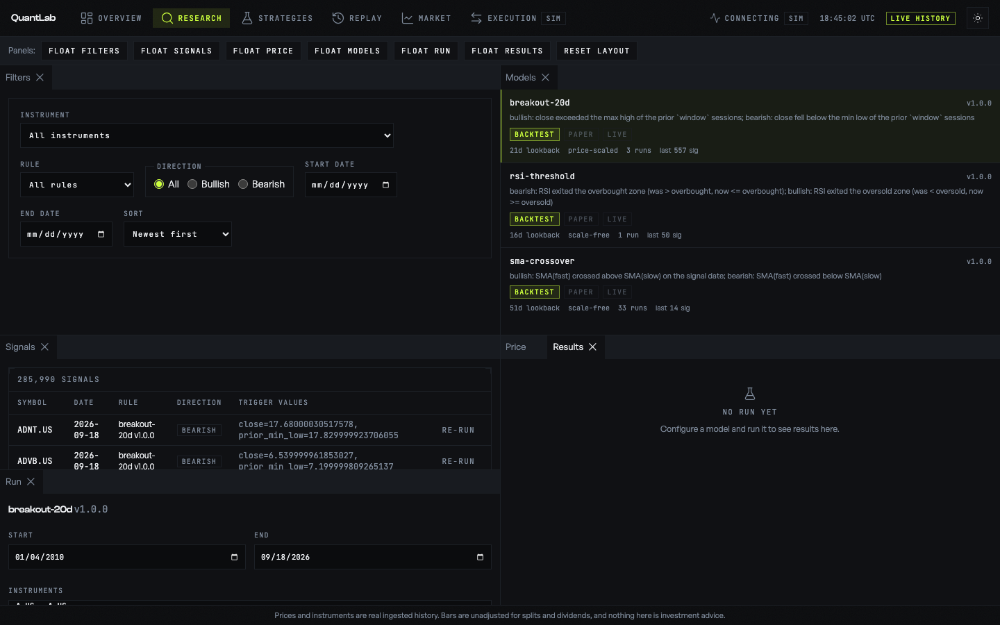
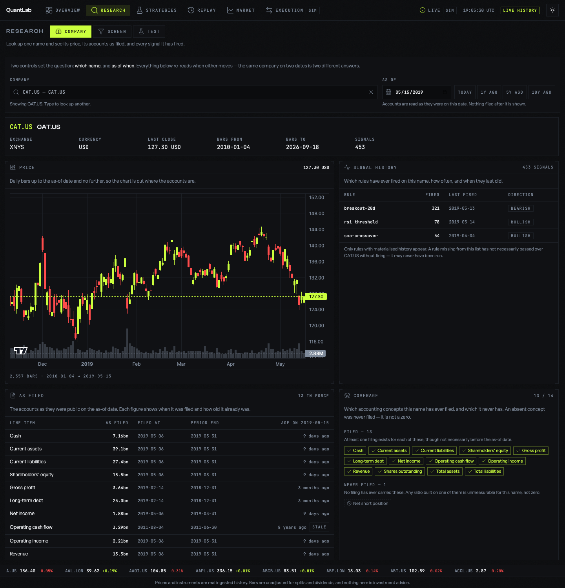
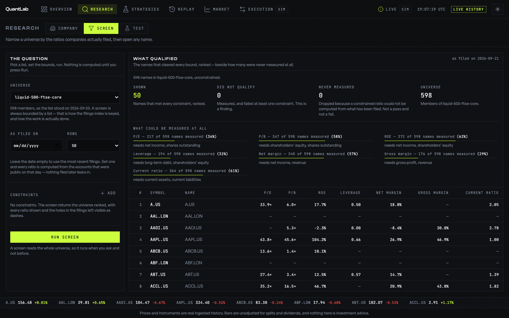
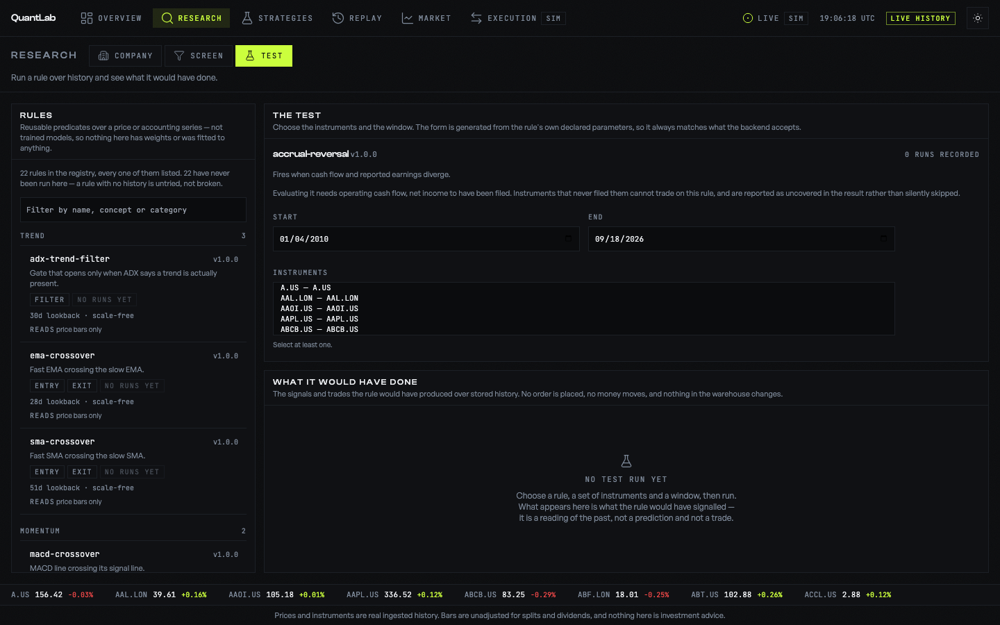

# Research: a destination a researcher can read

Status: design, with the evidence it rests on. Every number below was measured
against the running warehouse on 2026-09-21, not estimated.

The brief was a complaint, and it is worth quoting exactly, because the fix has
to answer it rather than something adjacent:

> the research tab needs a bit of revamp. I don't understand the reseaerch part
> easily. the feature that is available is not self evident. the each panels are
> not obvious what it means or what does it do.

Three separate failures are named there — *I can't understand it*, *I can't see
what it offers*, *I can't tell what a panel is for* — and they have three
different causes. This document separates them, then proposes one shape.

---

## 1. What is on the screen today



Six dockable panels — **Filters, Signals, Price, Models, Run, Results** — under a
strip of seven buttons reading `FLOAT FILTERS … RESET LAYOUT`.

Read it as a first-time user. The top strip is a window manager. The largest
panel is a table headed **285,990 SIGNALS** whose rows say
`close=17.68000030517578, prior_min_low=17.829999923706055`. The `Run` panel is
floating and cuts the signal table off through its third row. `Price` is a tab
hidden behind `Results`, which says *no run yet*.

Nothing on the destination states what it is for.

### 1a. The panels are named after tables, not after work

`Signals`, `Models`, `Runs` are the system's internal nouns — they are, almost
literally, the Postgres table names (`signals`, `signal_rules`,
`experiment_runs`). An equity researcher's nouns are a **company**, a
**question**, and a **result**.

`Models` is the worst of them, because it is not merely opaque but misleading:
these are not trained models, they are 22 reusable **rules** — predicates over a
price or accounting series. Calling them models implies a fitted artifact with
weights, and invites the question "trained on what?", which has no answer.

### 1b. The centrepiece is a stale artifact of a batch job

The signal table dominates the destination. Here is everything in it:

| rule | signals | symbols | range |
|---|---|---|---|
| breakout-20d | 197,659 | 608 | 2010-02-01 → 2026-09-18 |
| rsi-threshold | 49,578 | 609 | 2010-01-25 → 2026-09-18 |
| sma-crossover | 38,753 | 592 | 2010-03-15 → 2026-09-18 |

Three rules. The registry holds **22** — the three original builtins, ten in the
technical library, nine reading filed accounts. **Nineteen of the 22 rules have
never been materialised**, so the panel that occupies the most pixels is showing
the output of the three oldest rules in the system and is silent about the other
nineteen, including every fundamental rule shipped in the last change.

So the complaint *"the feature that is available is not self evident"* is not a
perception problem. The features genuinely are not on the screen. A user reading
this destination would reasonably conclude the product has three rules.

Worse, the table is the **entry point**. You arrive at 285,990 undifferentiated
rows sorted newest-first, with no default question and no reason to prefer any
row. That is a firehose, not a starting point.

### 1c. There is no company

This is the structural hole. The single most natural object in equity research —
*"show me Caterpillar"* — does not exist anywhere in the product.

The warehouse holds, keyed by instrument: 1.8M price bars over 2010–2026,
5,713,359 filed fundamental rows, 285,990 signals, and universe membership. The
API exposes exactly one per-company route, `GET /instruments/{symbol}/prices`,
and the UI can only reach it *by clicking a signal row* — you cannot look up a
company, only stumble onto one via a rule that happened to fire on it.

Everything a researcher does hangs off a company. The destination has no way to
name one.

### 1d. The dock is a cost, not a feature

Dockview gave the destination float, drag, resize, tab-merge and layout
persistence. All of it is chrome the user did not ask for and must now
understand, and one of its affordances is actively destructive: the floating
`Run` panel in the screenshot **occludes the signal table**, which is precisely
the "not properly fitted" defect reported earlier.

A dock is the right shape when a user has a settled workflow and wants their own
arrangement. It is the wrong shape when the user does not yet know what the
panels do — it asks them to arrange tools they cannot identify.

### 1e. Numbers are unformatted

`close=17.68000030517578` is a float64 printed with `repr`. No human writes a
price to 17 significant figures. The `trigger_values` JSON is dumped
key-by-key without units, precision, or labels. This alone makes the table read
as debug output, which colours everything around it.

---

## 2. What the backend can actually answer

Design constrained by measurement, so the UI cannot promise what the data will
not support. All figures from the live warehouse.

### Coverage is uneven and must be shown, never averaged away

644 catalogued instruments. **580 have some fundamentals; 64 have none.** Within
the 580, coverage by concept varies more than two to one:

| concept | symbols | | concept | symbols |
|---|---|---|---|---|
| net_income, total_assets | 468 | | revenue | 376 |
| cash, equity | 437 | | operating_income | 375 |
| operating_cash_flow | 438 | | current_assets/liabilities | 372 |
| shares_outstanding | 425 | | capex | 345 |
| total_liabilities | 423 | | long_term_debt | 293 |
| | | | gross_profit | **237** |
| | | | net_short_position | **77** |

A gross-margin screen therefore runs over 237 names, not 580. **The UI must say
so on the screen that offers it.** A screen that silently returns fewer names
reads as "few companies qualified" when the truth is "most were never measured"
— the same class of silent-wrongness the point-in-time work was about.

### Two things the catalogue cannot support

**Sector is empty.** 607 of 644 instruments have a blank `sector`; the
remainder are 25 `Synthetic`, 11 `Macro`, 1 `Tech`. There is no sector screen,
no peer group, no "compare to industry". Proposing one would be proposing a
feature the data cannot serve.

**Corporate actions is empty.** The table exists with zero rows. No splits or
dividends panel.

### 88.8% of the fundamentals table is unmapped — and EPS is in it

5,073,321 of 5,713,359 rows carry an **empty `concept`**: the ingest stored the
raw XBRL tag but never mapped it to one of the 18 known concepts. The largest
unmapped tags are not obscure:

| tag | rows |
|---|---|
| EarningsPerShareDiluted | 40,557 |
| EarningsPerShareBasic | 40,538 |
| LiabilitiesAndStockholdersEquity | 36,032 |
| IncomeTaxExpenseBenefit | 35,307 |
| RetainedEarningsAccumulatedDeficit | 35,192 |
| WeightedAverageNumberOfDilutedSharesOutstanding | 33,965 |
| NetCashProvidedByUsedInFinancingActivities | 33,952 |
| NetCashProvidedByUsedInInvestingActivities | 33,433 |
| ShareBasedCompensation | 31,945 |
| PropertyPlantAndEquipmentNet | 30,801 |

**Reported EPS is already ingested and invisible.** The system currently
computes an implied P/E from `net_income / shares_outstanding`; the filed,
audited diluted EPS sits in the same table under a tag nothing reads. Mapping it
is a concept-map change, not an ingest — the rows are on disk. Noted here as the
highest-value follow-up; it is out of scope for this change because it belongs
with the ingest concept map, not the UI.

### A screen must be universe-bounded, and that is a measured constraint

`fundamentals_pit_idx` is `(instrument_id, concept, filed_at)`. It leads with
`instrument_id`, so a screen that names no instruments cannot use it:

| query | plan | time |
|---|---|---|
| 8 concepts, no instrument bound | Parallel Seq Scan, 1.78M rows filtered away | **6,700 ms** |
| 5 concepts, `instrument_id = ANY(644)` | index scan | **836 ms** |

Eight times faster. So the screener takes a universe as an argument rather than
defaulting to "everything". That is also how research actually works — you
screen *within* a list — so the constraint and the product agree. There is one
real universe available, `liquid-500-ftse-core`, with 598 members.

**The 836ms is the SQL, and the screen is not that fast.** Measured end to end
against the live warehouse it is **3–5 seconds**: the query is a fraction of
it, and the rest is the driver fetching ~348,000 rows and Python building the
fact series over them. Narrowing the requested metrics cuts it proportionally
(three metrics is 3.1s). The obvious optimisation — dropping rows older than
`max_stale_days` before building — is declined on purpose: in a restatement it
can change which period wins, and a screen that disagrees with a backtest is
the one outcome this design is organised to prevent. So the screen is an
explicit action with a visible working state, never a keystroke.

### What is already built and merely unrouted

`storage/backends.facts_as_of(symbol, as_of, concepts)` exists on both backends
and **has no HTTP route**. It resolves the accounts as filed on a date, and it
does so by calling the same `load_facts_for` the backtest calls — so a company
page built on it cannot disagree with a backtest. That is the one seam worth
preserving exactly as-is: the screen that exists to make point-in-time
believable must not be a second implementation of it.

---

## 3. The four readings

**Product.** The destination has no answer to "what is this for" and no default
question. Fix: name the work, not the tables; give one obvious starting action;
disclose progressively — one company, then many, then a test.

**Equity research.** The real workflow is four steps: *screen* a universe →
*study* one name → *compare* → *test a thesis*. The destination today supports
only the fourth, and adds a fifth activity — browsing raw signal output — that
appears in no researcher's workflow. The missing first and second steps are the
ones where the time actually goes. Comparison is deferred: with sector empty
there is no peer group, and a defensible comparison needs one.

**Design.** Replace dock chrome with three fixed, purposeful layouts. Every
panel gets a one-line statement of what it is. Numbers get formatted to the
precision a human reads. Keep the established system — Clash Display / General
Sans / JetBrains Mono with tabular numerals, `#BFFF3C` as the single accent,
`#FF4D4D` for losses only.

**Engineering.** Three endpoints, two of them thin. Reuse `load_facts_for` for
all three so PIT correctness has exactly one implementation. Bound the screen by
universe because the index requires it. Do not break saved layouts — retire them
with a fallback rather than a crash.

---

## 4. The shape

Research becomes **three modes**, each named for the work and carrying a plain
sentence of purpose:

```
  ┌────────────────────────────────────────────────────────────┐
  │  RESEARCH    [ Company ]  [ Screen ]  [ Test ]             │
  │  Look up one name and see everything filed about it.       │
  └────────────────────────────────────────────────────────────┘
```

### Company — the default, and the object that was missing

Search by symbol or name, then see, for one instrument, as of a date you
control:

- **Price** — the candlestick history already available.
- **As filed** — the accounts that were public on that date, each with its
  `filed_at` beside it and a staleness marker. This is the PIT inspector, and it
  is the screen that makes the discipline visible.
- **Signal history** — which rules fired on this name and when, formatted for
  reading rather than dumped.
- **Coverage** — which concepts this name has and which it lacks, stated rather
  than implied by absence.

Landing here answers "what is this for" in one line, and the first action —
type a symbol — is obvious.

### Screen — the universe, narrowed

Pick a universe, add metric constraints (P/E, ROE, leverage, margin, growth),
get a ranked table. Every constraint shows its own coverage: *"gross margin —
237 of 598 names measured"*. Clicking a row opens it in Company.

This also delivers the cross-sectional ranking deferred from the fundamentals
work, since a ranked screen is exactly that primitive.

### Test — today's capability, explained

The rule catalogue (renamed from **Models** to **Rules**), a run configuration,
and results. Each rule shows its category, its roles, the concepts it needs, and
its one-line summary — all of which the registry already carries and the UI
currently discards. All 22 appear, whether or not anything has been materialised
for them, which is what makes the other nineteen visible for the first time.

### What the signal firehose becomes

It stops being the entry point. Signal history lives inside Company, scoped to
one name, where it is a fact about that company rather than 285,990 rows about
nothing in particular.

---

## 5. Endpoints

| route | source | note |
|---|---|---|
| `GET /instruments/{symbol}/fundamentals?as_of=` | `facts_as_of` | exists, unrouted — thin |
| `GET /instruments/{symbol}/overview?as_of=` | composed | meta + last close + facts + signal counts + coverage |
| `GET /screen?universe=&...` | `load_facts_for` | universe-bounded; returns rank + per-metric coverage |

All three resolve fundamentals through `load_facts_for`, so there remains one
point-in-time implementation in the system.

---

## 6. What this change does not do

- **No sector or peer comparison.** The catalogue cannot support it (§2).
- **No corporate actions panel.** Zero rows (§2).
- **No EPS concept mapping.** High value, but it belongs to the ingest concept
  map rather than the research UI (§2).
- **No backfill of the nineteen unmaterialised rules.** Test mode makes them
  runnable and visible; materialising history for all of them is a batch
  concern.
- **The dock is retired from Research**, with saved layouts falling back rather
  than erroring. It was added to solve arrangement, and the reported problem is
  comprehension — the two want opposite things.

---

## 7. What shipped, verified against the warehouse

Every screenshot below was captured against the live warehouse through an
isolated backend, not a fixture.

### Company



`#/research?symbol=CAT.US&as_of=2019-05-15`. The address carries both halves of
the question, so a company is a bookmark — and a company *on a date*, because a
link that drops the date silently answers a different question.

The whole page moves with that date. At 2019-05-15 the last close is 127.30,
the chart is cut there, and 453 signals are counted with their last firings on
2019-05-13, 05-14 and 04-04. Ask for today instead and the same name reports
828.

The **As filed** panel is the one that earns the design. Three different
vintages sit in one table: cash filed 2019-05-06 for the quarter ending
2019-03-31, nine days old; gross profit still carrying the 2019-02-14 annual
filing, three months old; and operating cash flow last filed **2011-08-04**,
eight years stale and marked so. Coverage states 13 concepts filed and one —
net short position — never filed at all, because an absent concept is not a
zero.

### Screen



The exclusion ledger keeps *shown*, *did not qualify*, *never measured* and
*universe* as four separate figures and never sums them. Coverage is reported
for every metric whether or not it is constrained — P/E 217 of 598 (36%),
gross margin 176 (29%), leverage 194 (32%) — each naming the concepts it needs.
Unmeasured cells are em dashes. `AAL.LON` is a row of dashes: a name in the
universe that has filed nothing.

### Test



All 22 rules, grouped by category, each with its roles, lookback and the
concepts it reads. A rule that has never been run says so rather than being
absent. Selecting `accrual-reversal` states in the form what it needs —
*"Instruments that never filed them cannot trade on this rule, and are reported
as uncovered in the result rather than silently skipped."*

### Three defects found only by running it

None of these showed up in 415 passing tests; all three needed a browser and a
real database.

1. **The company page was not point-in-time.** Bars and facts were bounded by
   `as_of`; signals were not. Asked for CAT on 2024-06-30 it returned accounts
   filed by 2024-05-01, a chart cut at 2024-06-30, and a last signal dated
   **2026-09-01**. Fixed in the query, with a test on the bound.
2. **The destination scrolled the page instead of filling the viewport** —
   1,838px of document in a 900px window, with the accounts below the fold. The
   mode region was a block, so each mode's `FillColumn` had an inert `flex-1`
   and took its natural height.
3. **Test mode overflowed by 91px** and its results panel collided with the
   footer, because the configuration form was `shrink-0` and a rule with
   several parameters is tall.

### A data-quality finding, which is not a bug in this change

The top of a cheap-P/E screen is contaminated. `JAKK.US` screens at a P/E of
0.028 and an ROE of 3,982%. The warehouse holds two filings of its FY2025 net
income:

| value | filed | accession |
|---|---|---|
| 9,871,000 | 2026-03-02 | 0001185185-26-000723 |
| **9,871,000,000** | 2026-04-22 | 0001185185-26-001465 |

Same digits, 1000× apart. JAKKS has $249m of equity and $442m of total assets,
so a $9.87bn profit would be twenty-two times its balance sheet — the later row
is a scale error, and point-in-time correctly prefers the later filing.

**This is the screen being right.** `pe-filter` reads the identical figure in a
backtest, which is the contract this design is built on; a screen that quietly
disagreed with the rules would be the worse outcome. But it means the ingest is
carrying bad scale, and not once: **126 `(instrument, concept, period_end)`
groups** hold an exact 1000× duplicate. It belongs with the ingest's decimals
handling, alongside the unmapped-EPS work in §2.

## 8. What was retired

Dockview, and with it `src/workspace/`, `SignalsPage`, the dock's theme
mapping, its stylesheet, its test double and the dependency itself. Research
was its only consumer. It was added to solve arrangement; the reported problem
was comprehension, and the two want opposite things.

`usePanelSize` stays. It declares its own structural shape and never imported
the library, so charts size themselves as before; its test fake moved to
`tests/mocks/panel-api.ts`.
